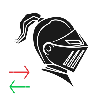

# CombatHeadgear

Yea, so, this toggles your headgear in-out of combat automatically with additional configuration!

- `/chg` or `/combatheadgear` to disabled or enable the behaviour
- Check the *configuration menu through dalamud* for more options

### Source: `https://raw.githubusercontent.com/GitPaulo/CombatHeadgear/master/repo.json`
